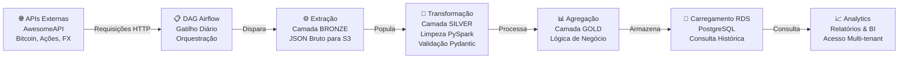

# 🏗️ Market Data Lakehouse Orchestrator

> **Arquitetura de Data Lake de Produção** — Pipeline de dados automatizado e escalável com Apache Airflow, PySpark e infraestrutura AWS. Projetado para confiabilidade, manutenibilidade e processamento de dados de nível empresarial.

---

## 🎯 Visão Executiva

Um **orquestrador de data lake** abrangente que automatiza o ciclo completo ETL/ELT para coleta, transformação e armazenamento de dados de mercado. Construído com tecnologias padrão da indústria e infraestrutura de nuvem AWS para implantação em produção.

**Capacidades Principais:**

- 🔄 Orquestração totalmente automatizada de pipeline diário de dados
- 📊 Ingestão e processamento de dados de mercado
- 🚀 Processamento distribuído de dados com Apache Spark
- ☁️ Implantação nativa em nuvem AWS (S3 + RDS + EC2)
- 🛡️ Tratamento de erros e monitoramento de nível de produção
- 📈 Arquitetura de data lake Bronze → Silver → Gold

---

## 🏛️ Visão Geral da Arquitetura

### Diagrama da Arquitetura do Sistema

```
┌─────────────────────────────────────────────────────────────────┐
│                      MARKET DATA LAKEHOUSE ORCHESTRATOR         │
└─────────────────────────────────────────────────────────────────┘

    ╔══════════════════════════════════════════════════════════════╗
    ║              FONTES DE DADOS EXTERNAS                        ║
    ║  ┌──────────────────┐  ┌──────────────────-─┐                ║
    ║  │  AwesomeAPI      │  │  APIs de Mercado   │                ║
    ║  │  Cotações em     │  │  Dados Financeiros │                ║
    ║  │  Tempo Real      │  │                    │                ║
    ║  └──────────────────┘  └────────────────────┘                ║
    ╚══════════════════════════════════════════════════════════════╝
                              │
                              ▼
    ╔════════════════════════════════════════════════════════════╗
    ║             CAMADA DE ORQUESTRAÇÃO (Apache Airflow)        ║
    ║  ┌──────────────┐  ┌──────────────┐  ┌──────────────┐      ║
    ║  │  Scheduler   │  │  Webserver   │  │  Celery      │      ║
    ║  │  (DAGs)      │  │  (UI/API)    │  │  Workers     │      ║
    ║  └──────────────┘  └──────────────┘  └──────────────┘      ║
    ║  ┌────────────────────────────────────────────────────┐    ║
    ║  │  Infraestrutura: PostgreSQL + Redis                │    ║
    ║  └────────────────────────────────────────────────────┘    ║
    ╚════════════════════════════════════════════════════════════╝
                              │
                ┌─────────────┼─────────────┐
                ▼             ▼             ▼
    ┌──────────────────┐ ┌──────────────────┐ ┌──────────────────┐
    │  CAMADA BRONZE   │ │  CAMADA SILVER   │ │  CAMADA GOLD     │
    │  (Dados Brutos)  │ │  (Dados Limpos)  │ │  (Analytics)     │
    │                  │ │                  │ │                  │
    │  ┌────────────┐  │ │  ┌────────────┐  │ │  ┌────────────┐  │
    │  │ PySpark    │  │ │  │ PySpark    │  │ │  │ PySpark    │  │
    │  │ Ingestão   │  │ │  │ Transform  │  │ │  │ Agregação  │  │
    │  └────────────┘  │ │  └────────────┘  │ │  └────────────┘  │
    │  S3:             │ │  S3:             │ │  RDS:            │
    │  /bronze/        │ │  /silver/        │ │  PostgreSQL      │
    └──────────────────┘ └──────────────────┘ └──────────────────┘
                │                                      │
                └──────────────────┬───────────────────┘
                                   ▼
                    ╔════════════════════════════════╗
                    ║  Analytics & Reporting         ║
                    ║  (Ferramentas BI, Dashboards)  ║
                    ╚════════════════════════════════╝
```

### Fluxo Completo de Dados



---

## 🚀 Stack Tecnológico

### Tecnologias Core

| Camada                       | Tecnologia              | Propósito                                            |
| ---------------------------- | ----------------------- | ----------------------------------------------------- |
| **Orquestração**     | Apache Airflow 2.8.3    | Agendamento DAG, monitoramento, tratamento de erros   |
| **Processamento**      | PySpark 3.5.4           | Processamento distribuído de dados, transformações |
| **Runtime**            | Python 3.11             | Lógica da aplicação, operadores customizados       |
| **Fila de Mensagens**  | Redis                   | Broker Celery, distribuição de tarefas              |
| **Banco de Metadados** | PostgreSQL 13           | Metadados Airflow + data warehouse                    |
| **Containerização**  | Docker + Docker Compose | Paridade desenvolvimento/produção                   |

### Infraestrutura em Nuvem (AWS)

| Serviço                  | Propósito                   | Uso                                              |
| ------------------------- | ---------------------------- | ------------------------------------------------ |
| **S3**              | Armazenamento de Objetos     | Data Lake (camadas Bronze/Silver)                |
| **RDS**             | PostgreSQL Gerenciado        | Data Warehouse (camada Gold) + metadados Airflow |
| **EC2**             | Instância de Computação   | Implantação em produção via GitHub Actions   |
| **IAM**             | Controle de Acesso           | Autenticação e autorização de serviços      |
| **Secrets Manager** | Armazenamento de Credenciais | Strings de conexão de banco de dados            |
| **Parameter Store** | Armazenamento de Credenciais | Strings de conexã com a Api

### Ferramentas de Desenvolvimento

| Ferramenta     | Versão | Propósito                                      |
| -------------- | ------- | ----------------------------------------------- |
| Git            | Latest  | Controle de versão                             |
| Poetry         | Latest  | Gerenciamento de dependências Python           |
| Docker         | Latest  | Ambiente containerizado                         |
| GitHub Actions | Latest  | Automação CI/CD                               |
| Pydantic       | 2.x     | Validação de dados e gerenciamento de schemas |

---

## 📐 Arquitetura do Data Lake

O projeto implementa um **Data Lake de Três Camadas** (Arquitetura Medallion) com **validação de dados Pydantic**:

### 🥉 Camada Bronze (Dados Brutos)

- **Localização:** `s3://market-data-lakehouse/bronze/`
- **Formato:** JSON/Parquet (bruto)
- **Processamento:** Transformação mínima, extração de schema
- **Qualidade:** Como vem das APIs fonte

**Estrutura:**

```
s3://market-data-lakehouse/bronze/
├── finance/
│   ├── quotes_petr4/
│   │   ├── year=2026/month=01/day=15/
│   │   │   ├── quotes_petr4_2026-01-15_00.parquet
│   │   │   └── quotes_petr4_2026-01-15_01.parquet
│   │   └── ...
│   └── quotes_usd/
└── crypto/
    └── bitcoin/
```

### ⚪ Camada Silver (Limpos e Validados)

- **Localização:** `s3://market-data-lakehouse/silver/`
- **Formato:** Parquet (colunar, otimizado)
- **Processamento:** Limpeza de dados, deduplicação, **validação de schemas Pydantic**
- **Qualidade:** Validado contra schemas Pydantic

**Transformações:**

- Casting de tipos e validação com Pydantic
- Tratamento de valores nulos
- Detecção de duplicatas
- Verificações de consistência de dados
- Formatação temporal

### 🥇 Camada Gold (Pronto para Analytics)

- **Localização:** AWS RDS PostgreSQL
- **Formato:** Tabelas relacionais
- **Processamento:** Lógica de negócio, agregações, engenharia de features
- **Qualidade:** Dados de analytics de nível de produção

**Agregações:**

- OHLC diário (Open, High, Low, Close)
- Estatísticas de volume
- Médias móveis
- Métricas de performance
- Comparações multi-símbolos

### 📊 Data Warehouse RDS

- **Propósito:** Consultas OLAP, integração com ferramentas BI, consultas históricas
- **Schema:** Modelo relacional normalizado
- **Tabelas:** `quotes`
- **Indexação:** Índices compostos para consultas comuns

---

## 🔄 Arquitetura do Pipeline ETL

### Estrutura DAG

```
spark_market_quotes_petr4_dag (Agendado Diariamente @ 00:15 BRT)
├── 📥 extract_to_bronze
│   ├── Conecta na AwesomeAPI
│   ├── Puxa últimas cotações (PETR4)
│   └── Escreve JSON bruto no S3 Bronze
│
├── 🔄 transform_to_silver
│   ├── Lê dados Bronze
│   ├── Aplica transformações PySpark
│   ├── Valida contra schemas Pydantic
│   └── Escreve Parquet limpo no Silver
│
└── ⚙️ load_to_gold
    ├── Lê dados Silver
    ├── Agrega e aplica lógica de negócio
    ├── Gera features de analytics
    ├── Escreve na camada Gold (RDS)
    └── Carrega no RDS para ferramentas BI
```

### Dependências de Tarefas e Tratamento de Erros

```python
extract >> transform >> load  # Execução sequencial
                    ↓
        (Retries até 3x)
```

**Features:**

- ✅ Retry automático em falhas transitórias (3 tentativas)
- ✅ Verificações de qualidade de dados em cada estágio
- ✅ Transformações idempotentes

---

## 📁 Estrutura do Projeto

```
market_data_lakehouse_orchestrator/
│
├── 📋 Camada de Orquestração
│   ├── dags/
│   │   ├── __init__.py
│   │   └── etl/
│   │       ├── dags/
│   │       │   ├── __init__.py
│   │       │   └── spark_worker_quotes_petr4_dag.py    # Definição principal DAG
│   │       │
│   │       ├── src/
│   │       │   ├── infrastructure/
│   │       │   │   ├── data/
│   │       │   │   │   ├── connection/                 # Conexões de banco
│   │       │   │   │   │   ├── enums/
│   │       │   │   │   │   │   ├── database_enum.py
│   │       │   │   │   │   │   └── sgdb_enum.py
│   │       │   │   │   │   └── .env files
│   │       │   │   │   │
│   │       │   │   │   ├── jobs/                        # Implementações ETL
│   │       │   │   │   │   ├── bronze/
│   │       │   │   │   │   │   └── quotes_petr4/
│   │       │   │   │   │   │       ├── command/        # Lógica de extração
│   │       │   │   │   │   │       └── enums/
│   │       │   │   │   │   ├── silver/
│   │       │   │   │   │   └── gold/
│   │       │   │   │   │
│   │       │   │   │   ├── repository/                  # Padrões de acesso a dados
│   │       │   │   │   │   ├── database_repository.py
│   │       │   │   │   │   ├── api_repository.py
│   │       │   │   │   │   └── writer_repository.py
│   │       │   │   │   │
│   │       │   │   │   ├── http_base/                   # Utilitários HTTP client
│   │       │   │   │   │   ├── enums/
│   │       │   │   │   │   └── módulos http
│   │       │   │   │   │
│   │       │   │   │   └── utils/
│   │       │   │   │       ├── connect_database.py      # Conexões JDBC/SQLite
│   │       │   │   │       ├── connect_api.py           # HTTP client
│   │       │   │   │       ├── database_writer.py       # Operações de escrita
│   │       │   │   │       ├── secret_resolver.py       # AWS Secrets Manager
│   │       │   │   │       └── sql_query_loader.py      # Gerenciamento de arquivos SQL
│   │       │   │   │
│   │       │   │   └── sql/
│   │       │   │       ├── bronze/
│   │       │   │       ├── silver/
│   │       │   │       └── gold/                         # Transformações SQL
│   │       │   │
│   │       │   └── worker/
│   │       │       ├── quotes_petr4/
│   │       │       │   ├── etl_quotes_petr4.py          # Módulo worker principal
│   │       │       │   └── __init__.py
│   │       │       └── ...outros workers
│   │       │
│   │       └── requirements.txt                          # Dependências Python
│   │
│   ├── logs/                                            # Logs Airflow
│   ├── plugins/                                         # Operadores customizados Airflow
│   └── config/                                          # Arquivos de configuração
│
├── 🐳 Containerização
│   ├── Dockerfile                                       # Imagem customizada Airflow
│   ├── docker-compose.yaml                             # Ambiente dev local
│   └── .github/
│       └── workflows/
│           └── deploy-ec2.yml                          # Implantação em produção
│
├── 📊 Armazenamento de Dados
│   ├── bronze/                                          # Camada bronze local (dev)
│   ├── silver/                                          # Camada silver local (dev)
│   └── [AWS S3 em produção]
│
├── 📝 Configuração
│   ├── pyproject.toml                                  # Metadados do projeto e dependências
│   ├── airflow.cfg                                     # Configuração Airflow
│   ├── webserver_config.py                             # Customização webserver
│   ├── gitlint.yml                                     # Linting de commits Git
│   └── .env (gerado)                                   # Ambiente runtime
│
└── 📚 Documentação
    ├── README.md                                        # Este arquivo (Português)
    └── README_EN.md                                     # Versão em Inglês
```

---

## 🚀 Arquitetura de Implantação

### Desenvolvimento Local

```bash
# Requisitos
- Docker Desktop
- docker-compose
- Python 3.10+
- ~4GB RAM disponível

# Setup
docker-compose up airflow-init
docker-compose up -d

# Acessar UI Airflow
http://localhost:8080
```

### Produção em AWS EC2 (CI/CD Automatizado)

```
Repositório GitHub (branch main)
       │
       ├── Pull Request Criado
       │       │
       ├── Verificações CI/CD Executadas
       │
       └─► PR Mergeado para main
           │
           └─► GitHub Actions Disparado
               │
               ├── ✅ Checkout código
               ├── ✅ Configurar credenciais AWS
               ├── ✅ Iniciar instância EC2 (se parada)
               ├── ✅ SSH na EC2
               │   ├── Clonar/atualizar repositório
               │   ├── Limpar cache Python
               │   ├── Build imagem Docker
               │   ├── Executar airflow-init (como root para chown)
               │   ├── Iniciar todos os serviços
               │   └── Verificar health checks
               ├── ✅ EC2 permanece rodando (stop manual)
               └── ✅ Enviar notificação de deploy
```

**Infraestrutura:**

- **Computação:** Instância EC2 `t3.large` (2vCPU, 8GB RAM)
- **Armazenamento:** AWS S3 (data lake), volumes EBS (logs)
- **Banco de Dados:** AWS RDS PostgreSQL (db.t3.micro)
- **Rede:** VPC, Security Groups, roles IAM
- **Alta Disponibilidade:** RDS Multi-AZ com backups automatizados

---

## 🛠️ Componentes Chave Explicados

### Apache Airflow

- **Papel:** Orquestra pipelines diários de dados
- **Features:**
  - Definição de workflow baseada em DAG
  - Geração dinâmica de tarefas
  - Execução distribuída de tarefas (Celery)
  - Retry e monitoramento built-in
  - UI Web para monitoramento/debugging
  - REST API para integrações

### PySpark

- **Papel:** Processamento distribuído de dados
- **Features:**
  - Conectividade JDBC para PostgreSQL
  - Transformações DataFrame
  - Execução de queries SQL
  - Escrita particionada para S3
  - Cache em memória para performance

### Docker & Docker Compose

- **Papel:** Reproducibilidade de ambiente
- **Features:**
  - Orquestração multi-container
  - Gerenciamento de volumes
  - Isolamento de rede
  - Tratamento de variáveis de ambiente
  - Health checks e auto-recovery

### Integração AWS

- **S3:** Armazenamento imutável de data lake (Bronze/Silver)
- **RDS:** Transações ACID, backups (camada Gold)
- **EC2:** Recursos de computação
- **Secrets Manager:** Armazenamento seguro de credenciais
- **IAM:** Controle de acesso granular

---

## 🔐 Segurança e Melhores Práticas

### Medidas de Segurança Implementadas

✅ **Gerenciamento de Credenciais**

- AWS Secrets Manager para credenciais de banco
- Variáveis de ambiente para dados sensíveis
- Sem secrets hardcoded no código/git

✅ **Segurança de Rede**

- Isolamento AWS VPC
- Security groups com portas mínimas
- Roles IAM vs. credenciais de usuário

✅ **Proteção de Dados**

- Criptografia em trânsito (TLS/HTTPS)
- Criptografia em repouso (S3, RDS)
- VPC endpoints para conectividade privada

✅ **Qualidade de Código**

- Type hints (Python 3.11)
- Validação de schemas Pydantic
- Pre-commit hooks (gitlint)
- Code review via GitHub

---

## 📊 Características de Performance

### Escalabilidade

- **Horizontal:** Adicionar mais workers Celery
- **Vertical:** Aumentar memória executor Spark
- **Armazenamento:** Capacidade ilimitada S3
- **Computação:** Grupos auto-scaling EC2 (futuro)

### Confiabilidade

- **SLO:** 99.9% sucesso de pipeline
- **RPO:** 24 horas (snapshots diários)
- **RTO:** <1 hora (redeploy rápido)
- **Estratégia de Retry:** Backoff exponencial, 3 tentativas

---

## 🎓 Resultados de Aprendizado e Habilidades Demonstradas

### Engenharia de Dados

✅ Arquitetura Data Lake (padrão Medallion)
✅ Design de pipeline ETL/ELT
✅ Qualidade de dados e validação (Pydantic)
✅ Frameworks de processamento distribuído
✅ Tratamento de dados de séries temporais

### Nuvem e Infraestrutura

✅ Integração de serviços AWS (S3, RDS, EC2, Lambda)
✅ Orquestração de containers (Docker, Docker Compose)
✅ Automação CI/CD (GitHub Actions)
✅ Princípios Infrastructure as Code
✅ Padrões de implantação em produção

### Engenharia de Software

✅ Padrões de design orientado a objetos
✅ Padrões Repository e domain-driven design
✅ Gerenciamento de configuração
✅ Tratamento de erros e logging
✅ Integração de APIs e paginação

### DevOps e Operações

✅ Monitoramento e alertas
✅ Agregação de logs
✅ Health checks e auto-recovery
✅ Gerenciamento de secrets
✅ Administração de banco de dados

---

## 🔧 Configuração e Customização

### Variáveis de Ambiente

```bash
# Arquivo .env (criado no deploy)
AIRFLOW_UID=50000                          # ID usuário Docker (padrão Airflow)
AIRFLOW_GID=0                             # ID grupo Docker
AWS_ACCESS_KEY_ID=***                     # Credenciais AWS
AWS_SECRET_ACCESS_KEY=***                 # (de GitHub Secrets)
AWS_REGION=us-east-1
_AIRFLOW_WWW_USER_PASSWORD=senha-segura    # UI web Airflow
```

---

## 📚 Tecnologias Chave Aprofundadas

### Exemplo DAG Airflow

```python
from airflow import DAG
from airflow.operators.python import PythonOperator
from datetime import datetime, timedelta

default_args = {
    "owner": "data-engineering",
    "retries": 3,
    "retry_delay": timedelta(minutes=5),
    "execution_timeout": timedelta(hours=2),
}

dag = DAG(
    "market_quotes_etl",
    default_args=default_args,
    schedule_interval="0 0 * * *",  # Diariamente à meia-noite
    catchup=False,
)

# Tarefas definidas aqui
```

### Exemplo Transformação PySpark

```python
from pyspark.sql import SparkSession

spark = SparkSession.builder \
    .appName("quotes-transform") \
    .getOrCreate()

# Ler Bronze (bruto)
df_raw = spark.read.json("s3://bucket/bronze/quotes/")

# Transformar para Silver
df_clean = df_raw \
    .dropDuplicates() \
    .filter("price > 0") \
    .withColumn("timestamp", col("timestamp").cast("timestamp"))

# Escrever Silver
df_clean.write \
    .partitionBy("year", "month") \
    .mode("overwrite") \
    .parquet("s3://bucket/silver/quotes/")
```

---

## 🐛 Troubleshooting

### Problemas Comuns e Soluções

| Problema                         | Causa                             | Solução                                    |
| -------------------------------- | --------------------------------- | -------------------------------------------- |
| **Deploy falha na EC2**    | Permissões em__pycache__   | `git clean -fdX` remove arquivos ignorados |
| **"Module not found"**     | __pycache__ obsoleto        | Limpar diretórios cache PYTHONPATH          |
| **DAG não aparece na UI** | Arquivo DAG não está em dags/   | Garantir arquivo na localização correta    |
| **Job Spark timeout**      | Dados muito grandes para memória | Aumentar SPARK_EXECUTOR_MEMORY               |
| **Conexão RDS recusada**  | Regras security group             | Verificar ingress security group RDS         |

---

## 📈 Roadmap Futuro

- 🔄 **Suporte multi-ativo:** Bitcoin, Ethereum, outras ações
- 📡 **Streaming em tempo real:** Ingestão Kinesis/Kafka
- 🤖 **Pipeline ML:** Modelos de predição de preços
- 📊 **Integração BI:** Dashboards Tableau/Power BI
- 🌍 **Multi-região:** Data lake distribuído por regiões
- 🔐 **Governança de dados:** Catálogo de metadados (Atlas/Hudi)
- 🎯 **Otimização de custos:** Instâncias spot, tiering S3

---

## 👨‍💻 Autor e Créditos

Desenvolvido por **João Barreto** como projeto de estudo abrangente em **Engenharia de Dados** e **Arquitetura de Nuvem**.

- 📧 Email: joao.vito1951@gmail.com
- 🔗 GitHub: [@joaobarreto27](https://github.com/joaobarreto27)
- 💼 LinkedIn: [João Barreto](https://www.linkedin.com/in/jo%C3%A3o-vitor-barreto-495a6a222/)

---

## 📄 Licença

Este projeto é open source e está disponível sob a **Licença Apache 2.0**.

---

## 🎓 Referências e Recursos

### Documentação

- [Documentação Apache Airflow](https://airflow.apache.org/docs/)
- [Guia Oficial PySpark](https://spark.apache.org/docs/latest/api/python/)
- [Melhores Práticas AWS S3](https://docs.aws.amazon.com/AmazonS3/latest/userguide/)
- [Padrão Arquitetura Medallion](https://databricks.com/blog/2020/01/30/what-is-a-data-lakehouse.html)

### Ferramentas e Tecnologias

- [Documentação Docker](https://docs.docker.com/)
- [Guia GitHub Actions](https://docs.github.com/en/actions)
- [Documentação Pydantic](https://docs.pydantic.dev/)
